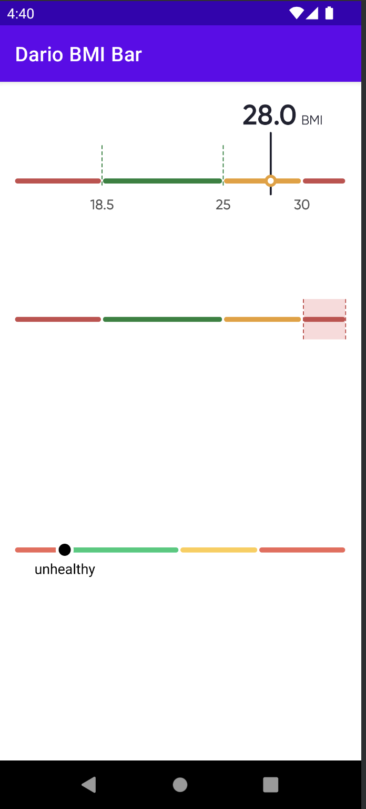

# DarioBMIBar
Android BMI Level component



## Install Dependency
If you haven't already, add the jitpack repository to the root `buil.gradle` file.

```gradle
allprojects {
    repositories {
        ...
        maven { url 'https://jitpack.io' }
    }
}
```

Add the dependency:
```gradle
implementation 'com.github.myDario:DarioBMIBar:1.0.3'
```

## Usage
Add the view in a layout:

```xml
<com.labstyle.dariobmibar.DarioBMIBar
    android:id="@+id/bmi"
    android:layout_width="0dp"
    android:layout_height="200dp"
    app:bmi="22.5"
    app:unitLabel="BMI"
    app:layout_constraintStart_toStartOf="parent"
    app:layout_constraintEnd_toEndOf="parent"
    app:layout_constraintTop_toTopOf="parent"
    app:layout_constraintBottom_toBottomOf="parent"/>
```

Change BMI at runtime

```kotlin
findViewById<DarioBMIBar>(R.id.bmi).setBMIValue(22.5f)
```

BMI Bar view with highlighted sections

```xml
<com.labstyle.dariobmibar.DarioBMISections
    android:id="@+id/bmiSections"
    android:layout_width="0dp"
    android:layout_height="200dp"
    app:bmi="22.5"
    app:layout_constraintStart_toStartOf="parent"
    app:layout_constraintEnd_toEndOf="parent"
    app:layout_constraintTop_toTopOf="parent"
    app:layout_constraintBottom_toBottomOf="parent"/>
```

Change BMI at runtime

```kotlin
findViewById<DarioBMISections>(R.id.bmiSections).setBMIValue(22.5f)
```
